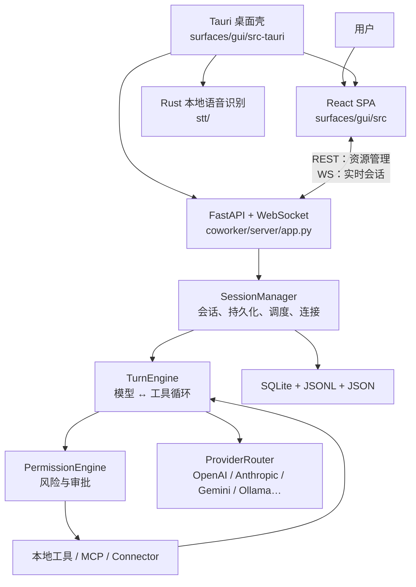
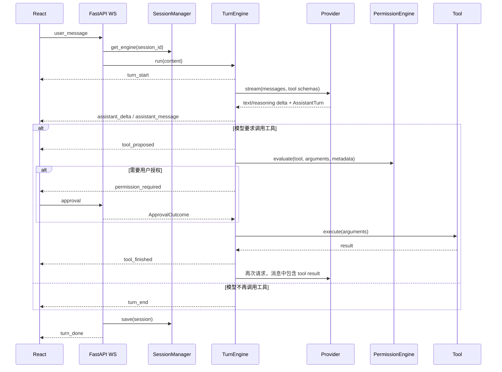

# OpenWorker 二次开发导览

> 面向以 TypeScript / React 为主、对 Python 不熟悉的开发者。  
> 本文基于仓库 `main` 分支当前代码（2026-07-30，`f96ad4c`）整理。

## 1. 先建立一个正确的心智模型

OpenWorker 不是一个单纯的聊天前端，也不是“调用一次 LLM API 然后返回文本”。它是一个本地优先的 Agent 运行时：



最重要的边界：

- React 不直接调用模型，也不执行工具。
- FastAPI 的 `app.py` 是传输层和协议层，不是 Agent 核心。
- `SessionManager` 是后端总协调器，负责“某个 session 应该使用哪个 Engine、模型、工作区和持久化数据”。
- `TurnEngine` 才是 Agent loop：调用模型、解析 tool call、审批、执行工具、把结果喂回模型，直到模型给出最终答案。
- Persona 决定“是谁、有什么基础能力”；Skill 是按需加载的提示词能力包；Tool 才是真正可执行的函数。
- Tauri 主要负责桌面生命周期和原生能力。浏览器开发模式可以绕开 Tauri，直接连接 Python 服务。

如果只准备改业务能力，建议先忽略 `stt/`、`packaging/` 和大部分 Tauri 代码，先读 React、`SessionManager`、`build_engine()`、`TurnEngine`。

## 2. 技术栈与进程

| 层 | 技术 | 入口 | 职责 |
|---|---|---|---|
| Web UI | React 18、TypeScript、Vite、Tailwind | `surfaces/gui/src/main.tsx` | 会话、设置、审批卡片、连接器、自动化等界面 |
| 前端通信 | Fetch、WebSocket | `surfaces/gui/src/api.ts` | 所有 REST helper 和 `Session` WS 客户端 |
| 桌面壳 | Tauri 2、Rust | `surfaces/gui/src-tauri/src/lib.rs` | 启动 Python sidecar、窗口/托盘、自动更新、原生文件选择、语音 |
| Agent 服务 | Python 3.10+、FastAPI、Uvicorn | `coworker/server/run.py` | 本地 HTTP / WS 服务 |
| Agent runtime | Python、aisuite | `coworker/engine.py` | 模型流式输出、工具循环、中断、恢复 |
| 模型适配 | OpenAI / Anthropic / Google SDK 等 | `coworker/providers/` | 统一消息、流、tool call 和 token usage |
| 数据 | SQLite、JSONL、JSON | `coworker/conversations.py` 等 | 会话、记忆、自动化、设置、连接状态 |
| 本地语音 | Rust、whisper-rs | `stt/src/lib.rs` | 桌面端离线语音输入 |

### 两种开发运行方式

浏览器模式有三个主体：

```text
浏览器 React (:1420) ⇄ Python 服务 (:8765) ⇄ 模型和本地工具
```

桌面模式有三个主体：

```text
Tauri 进程 ─启动→ 随机端口 Python sidecar
    └─承载→ React WebView
```

Tauri 会生成一次性 token，把 sidecar 的 HTTP / WS 地址注入页面。浏览器模式则由 Vite 从状态目录中的 `sidecar-8765.token` 读取 token。

## 3. 从哪里开始读

推荐顺序如下，前 8 个文件可以覆盖主干：

1. `surfaces/gui/src/api.ts`
   - 看 REST helper 和最下方的 `Session` 类。
   - 它相当于前端项目中的 API SDK。
2. `surfaces/gui/src/App.tsx`
   - 先定位 `handleEvent`、`send` 和创建 `new Session(...)` 的 effect。
   - 不建议第一遍从头通读 1700 多行。
3. `coworker/server/app.py`
   - 先看 `create_app()`、`/v1/sessions` 和 `/ws/session/{session_id}`。
4. `coworker/server/manager.py`
   - 先看 `SessionManager.__init__()`、`get_engine()`、`save()`。
5. `coworker/agent.py`
   - 看 `build_engine()` 如何把 Persona、工具、权限、记忆、Skill、MCP 拼起来。
6. `coworker/engine.py`
   - 看 `run()` → `_loop()` → `_handle_tool_calls()` → `_authorize()`。
7. `coworker/permissions.py`
   - 看 `PermissionEngine.evaluate()`。
8. `coworker/conversations.py`
   - 看 session 怎样落到 SQLite 与 JSONL。

然后再按需求进入：

- 改 Persona：`coworker/agents/`、`coworker/personas/`
- 改本地工具：`coworker/tools/`、`coworker/catalog.py`
- 改模型：`coworker/providers/`
- 改 MCP：`coworker/mcp/`
- 改 SaaS / 消息平台：`coworker/connectors/`
- 改定时任务：`coworker/automation/`
- 改桌面能力：`surfaces/gui/src-tauri/`

## 4. 仓库地图

```text
openworker/
├── coworker/                  Python 后端
│   ├── server/
│   │   ├── run.py             服务命令入口、token、Uvicorn
│   │   ├── app.py             REST / WebSocket 协议
│   │   └── manager.py         后端总协调器
│   ├── engine.py              Agent 主循环
│   ├── agent.py               Engine 组装工厂
│   ├── permissions.py         风险与授权决策
│   ├── risk.py                工具风险分类
│   ├── agents/                Code / Chat / Cowork 的定义
│   ├── personas/              Persona manifest、安装、注册
│   ├── tools/                 文件、shell、git、搜索、todo、子 Agent
│   ├── providers/             模型 Provider 适配与路由
│   ├── connectors/            Slack、Gmail、Calendar、GitHub 等集成
│   ├── mcp/                   MCP client、配置、OAuth、工具包装
│   ├── memory/                长期记忆
│   ├── automation/            定时任务和执行历史
│   ├── conversations.py       会话索引和 JSONL 消息
│   ├── inbox.py               跨会话审批 / 问题队列
│   ├── selfwake.py            Agent 自我唤醒
│   ├── config.py              TOML 分层配置
│   └── secrets.py             状态目录和 secret store
├── surfaces/gui/
│   ├── src/                   React SPA
│   ├── e2e/                   Mock 后端的 Playwright 测试
│   └── src-tauri/             桌面壳
├── stt/                       Rust 离线语音
├── tests/                     Python 后端测试
├── packaging/                 开发环境、DMG、Windows 打包
├── docs/                      文档
├── pyproject.toml             Python 包、依赖、CLI 入口
└── README.md                  产品介绍和基本启动方式
```

### 当前代码结构上的现实情况

`coworker/server/manager.py`、`coworker/server/app.py`、`surfaces/gui/src/App.tsx` 和 `surfaces/gui/src/api.ts` 都是大文件。它们分别承担了过多协调、路由、页面状态和 API 类型职责。二次开发时应优先做局部扩展，不要一开始就全量重构；新增相对独立的能力时，可以把实现放入新模块，只在这些“大枢纽文件”中保留装配和路由。

## 5. 一条用户消息的完整生命周期

### 5.1 前端发送

`App.tsx` 的 `send()` 先乐观地把用户消息加入 React state，再调用：

```ts
sessionRef.current?.userMessage(text, attachments, model);
```

`api.ts` 中的 `Session.userMessage()` 发送：

```json
{
  "type": "user_message",
  "text": "用户输入",
  "model": "模型 id",
  "attachments": []
}
```

WebSocket 地址为：

```text
/ws/session/{sessionId}?workspace=...&agent=...
```

### 5.2 FastAPI 接收并绑定 Engine

`coworker/server/app.py` 的 `ws_session()`：

1. 校验 sidecar token 与 Origin。
2. 准备 MCP 工具。
3. 通过 `manager.get_engine()` 获取或创建该 session 的 `TurnEngine`。
4. 返回 `ready` 事件，包含 agent、model、mode、workspace。
5. 校验消息和附件大小。
6. 调用 `engine.run(content)`。

同一 session 同时只允许一个 turn。`SessionManager.try_mark_running()` 防止连续两个 frame 同时启动。

### 5.3 Engine 进入模型工具循环



`TurnEngine._loop()` 最多执行 `max_iterations` 次。每次模型响应可能是：

- 文本；
- reasoning；
- 一个或多个 tool call；
- 文本与 tool call 同时存在。

低风险且明确声明可并行的工具会通过 `asyncio.gather()` 并行执行；写文件、shell 和没有风险元数据的工具按顺序执行。

### 5.4 实时事件回到 React

后端 `EventType` 是前后端的实时协议。主要事件：

| 事件 | React 行为 |
|---|---|
| `ready` | 更新 model、mode、workspace、连接状态 |
| `turn_start` | 标记运行中，必要时补入后台触发的用户消息 |
| `assistant_delta` | 追加流式文本 |
| `reasoning_delta` | 追加思考流 |
| `assistant_message` | 把流式内容固化为 transcript item |
| `tool_proposed` | 添加工具卡片；`todo_write` 同步右侧进度 |
| `permission_required` | 显示审批卡 |
| `directory_requested` | 显示目录授权卡 |
| `plan_proposed` | 显示计划审批卡 |
| `question_requested` | 显示 Agent 提问 |
| `tool_finished` | 更新最后一个对应工具卡片 |
| `error` / `interrupted` | 固化部分流并显示 notice |
| `turn_done` | 清除 running、刷新 session 和 artifact |

历史重放不走这些事件，而是通过 `GET /v1/sessions/{id}/messages` 获取 canonical messages，再由 `itemsFromMessages.ts` 转换为 UI 的 `Item[]`。

这意味着修改消息结构时通常要同时检查两条渲染路径：

1. 实时路径：`App.tsx` 的 `handleEvent`；
2. 重放路径：`itemsFromMessages.ts`。

## 6. Agent 的几个核心概念

这些名字很相似，但职责不同。

| 概念 | 本质 | 何时加载 | 是否执行代码 | 主要位置 |
|---|---|---|---|---|
| Agent | 运行时对象：prompt、基础工具、family 等 | 创建 session Engine 时 | 间接持有工具 | `coworker/agents/base.py` |
| Persona | 可安装、可启停的 Agent 配方 | 选择 persona / 恢复 session 时 | manifest 本身不执行代码 | `coworker/personas/` |
| Skill | 按需加载的指令与资源包 | 模型调用 `load_skill` 时 | 可指向脚本资源，但首先是说明 | `coworker/skills/base.py` |
| Tool | 暴露给模型的可调用函数 | Engine 构建时注册 | 是 | `coworker/tools/` |
| Capability | 一组平台审核过的 Tool | Persona 展开工具 id 时 | 组装函数 | `coworker/catalog.py` |
| MCP server | 外部标准工具服务 | session 连接 / reload 时 | 外部进程或 HTTP 服务 | `coworker/mcp/` |
| Connector | Gmail、Slack 等业务集成 | 服务启动或 Engine 构建时 | 是 | `coworker/connectors/` |
| Provider | 模型厂商协议适配器 | 首次使用某 provider 时懒加载 | 调用模型 SDK | `coworker/providers/` |

### Agent 与 Persona

运行时 `Agent` 是一个 dataclass，大致等价于：

```python
Agent(
    name="cowork",
    title="Cowork",
    system_prompt="...",
    needs_workspace=True,
    tool_factory=...,
    family="knowledge",
    messaging=True,
    connectors=True,
)
```

内置 Code / Chat / Cowork 使用 Python builder。额外 Persona 可以通过带 YAML frontmatter 的 Markdown manifest 定义，然后由 `PersonaManifest.to_agent()` 转成相同的 `Agent`。

`family` 目前是重要开关：

- `code`：要求用户选择真实项目目录，并获得只读 explorer 子 Agent。
- `knowledge`：可自动创建 scratch workspace，支持多目录、定时任务和 self-wake。

### Skill

Skill 搜索位置：

```text
<state-dir>/skills/<skill>/SKILL.md
<workspace>/.coworker/skills/<skill>/SKILL.md
```

启动 session 时只把 Skill 的名称和描述加入 prompt。完整说明在模型调用 `load_skill(name)` 后才进入上下文，这就是代码注释中的 progressive disclosure。

### Tool

每个 Tool 最终进入 `ToolRegistry`，其中包含：

- `name`：模型看到和调用的函数名；
- `schema`：OpenAI function-tool 格式 JSON schema；
- `func`：真实 Python callable；
- `metadata`：风险级别、category、是否需要审批等。

`ToolRegistry` 不处理权限；权限只在 `TurnEngine._authorize()` 中处理。

## 7. Engine 是怎样被组装出来的

`coworker/agent.py::build_engine()` 是整个后端最值得读的装配函数。它大致按以下顺序工作：

1. 解析 workspace 和 roots。
2. 读取全局及 workspace TOML 配置。
3. 为需要 workspace 的 Agent 创建持久 shell executor 和 todo list。
4. 注册 Persona 的基础 capability tools。
5. 注册 MCP tools。
6. 按 Persona 特征注册消息、Connector、web、ask_user、subagent、automation、self-wake tools。
7. 拼接 system prompt、环境信息、`AGENTS.md`、memory 和 Skill catalog。
8. 创建 `PermissionEngine`。
9. 创建 `TurnEngine`，注入 provider、tools、permissions、approval callbacks。

这里有一个很实用的判断：

- “这个工具只属于某种 Persona” → 放入 Persona 的 capability。
- “所有 Agent 都应该有” → 在 `build_engine()` 公共注册段装配。
- “它来自外部 MCP” → 走 `SessionManager.prepare_mcp_tools()`，不要硬塞进内置 catalog。
- “只是改变模型行为，不需要新执行能力” → 优先改 Persona / Skill，不要新建 Tool。

## 8. 权限与安全模型

工具执行前，`PermissionEngine.evaluate()` 根据风险和模式返回：

```python
Decision(
    allowed=True/False,
    reason="...",
    needs_user=True/False,
)
```

### 模式

| 模式 | 行为 |
|---|---|
| `discuss` | 只读，不进入计划审批工作流 |
| `plan` | 只读，Agent 可用 `propose_plan` 请求退出计划模式 |
| `interactive` | 低风险自动执行，写入、shell、外部操作请求审批 |
| `auto` | 允许有后果的操作，但仍受路径范围等硬限制 |
| `custom` | 类似 interactive，额外自动允许 `auto_allow` 中的工具 |

### 风险类别

风险分类位于 `coworker/risk.py`，主要分为：

- read：读取、搜索；
- write-local：修改本地文件；
- exec：运行 shell；
- external：发消息、改日历等外部副作用。

即使处于 `auto`，本地写入仍必须落在可写 root 内。`plan` / `discuss` 会直接拒绝有后果的工具，而不是弹出审批。

### 审批为什么会进入 Inbox

实时会话中的审批、提问、目录申请和计划审批都会先持久化成 `InboxItem`，再等待结果。attended session 的 item 只在当前对话内显示；unattended session 的 item 出现在跨会话 Inbox。

这样做的价值是：

- WebSocket 断开后审批不丢；
- 可以从 App、Slack 或 REST 中任意一个 surface 回答；
- `pending → resolved` 只发生一次，先到的答案获胜；
- 服务重启后可以从尚未回答的 tool call 恢复。

如果新增需要“等待用户”的交互，不要只在 WebSocket 内放一个临时 `Future`，应沿用 Inbox 的持久化模式。

## 9. 状态与持久化

默认状态目录：

- macOS / Linux：`~/.config/coworker`
- Windows：`%APPDATA%\coworker`
- 测试或自定义：环境变量 `COWORKER_STATE_DIR`

主要文件：

| 路径 | 内容 |
|---|---|
| `coworker.db` | session 索引、workspace、memory、audit |
| `conversations/<session>.jsonl` | canonical 对话消息，增量追加 |
| `automation.db` | 定时任务及 run 记录 |
| `prefs.json` | 默认模型、onboarding、界面偏好等非敏感设置 |
| `secrets.json` | Provider / Connector / MCP 凭据，POSIX 下限制为当前用户读取 |
| `config.toml` | 全局运行配置 |
| `mcp.json` | MCP server 配置 |
| `personas.json` | Persona 启用、展示、默认状态 |
| `personas-installed/` | 安装 Persona 的快照 |
| `inbox.json` | 待审批、待回答事项 |
| `wakes.json` | self-wake 记录 |
| `workspace_trust.json` | workspace 命令信任 |
| `sidecar-<port>.token` | 浏览器开发模式的临时本地 API token |
| `logs/openworker-server.log` | 桌面 sidecar 日志 |

会话消息使用接近 OpenAI 的 canonical 格式，常见 role：

- `system`
- `user`
- `assistant`
- `tool`
- `notice`：仅供 UI 展示的错误、中断、模型切换标记

`source`、`ts`、`reasoning`、`_display` 等是 sidecar 字段。`TurnEngine._outbound_messages()` 会在请求 Provider 前去掉不应进入模型上下文的显示数据。

### 开发时避免污染真实状态

建议用单独状态目录启动：

```bash
export COWORKER_STATE_DIR="$PWD/.dev-state"
.venv/bin/openworker-server --cwd "$PWD" --port 8765
```

`.dev-state/` 当前不在仓库 `.gitignore` 中。可以改用 `/tmp/openworker-dev-state`，或先把自己的开发目录加入本地 exclude，避免误提交凭据。

Python 测试已经通过 autouse fixture 为每个 test 隔离 `COWORKER_STATE_DIR`，不会读取开发者真实配置。

## 10. 配置加载

配置优先级：

```text
代码默认值
  < 全局 <state-dir>/config.toml
  < workspace/.coworker/config.toml
```

但权限相关字段有额外限制：

- `auto_allow` 只能来自全局配置；
- workspace 声明的 `allowed_commands` 只有在用户信任该 canonical workspace 后才生效。

常用字段：

```toml
model = "gpt-5.6-sol"
mode = "interactive"
max_iterations = 150
host = "127.0.0.1"
port = 8765
web_search_provider = "duckduckgo"
```

注意：当前 `docs/config.example.toml` 的 model、iteration 和命令 allowlist 是示例值，不完全等于代码默认值；特别是其中列出的 `python3`、`pytest`、`npm` 等命令会扩大免审批执行范围，不建议不加判断地整段复制。

## 11. 前后端接口约定

### REST 的职责

REST 主要管理可查询、可修改的资源：

- `/v1/health`
- `/v1/sessions`
- `/v1/sessions/{id}/messages`
- `/v1/sessions/{id}/artifacts`
- `/v1/personas`
- `/v1/providers`
- `/v1/connectors`
- `/v1/mcp`
- `/v1/automations`
- `/v1/inbox`
- `/v1/settings`

准确接口以 `coworker/server/app.py` 中的 `@app.get/post/...` 为准；前端对应 helper 集中在 `surfaces/gui/src/api.ts`。

### WebSocket 的职责

`/ws/session/{session_id}` 是双向会话通道：

- UI → server：用户消息、审批结果、问题答案、中断、重试、切模型、切模式；
- server → UI：`EventType` 流。

`/ws/events` 是只读的 app-wide 事件流，当前主要用于自动化任务开始通知。

### 修改协议时的清单

新增一个实时事件至少要同步：

1. `coworker/events.py` 增加后端事件；
2. Engine 或 Manager 发出事件；
3. `surfaces/gui/src/types.ts` 增加 TypeScript union；
4. `App.tsx::handleEvent` 消费事件；
5. 如果事件影响历史重放，再改 `itemsFromMessages.ts`；
6. 增加 Python 协议测试和 React / E2E 测试。

当前项目没有从 OpenAPI 自动生成前端类型，Python 与 TypeScript 契约靠人工同步，因此协议改动是最容易产生回归的位置之一。

## 12. 常见二次开发方式

### 12.1 只改变 Agent 身份和工作方法

优先级：

1. 新 Persona；
2. 新 Skill；
3. 修改内置 Agent prompt。

如果需求是“做一个专门的运营 Agent / 研究 Agent / 项目经理 Agent”，通常不需要复制 Engine。

Persona manifest 形态：

```markdown
---
id: product-researcher
name: Product Researcher
family: knowledge
tools: [files, search, shell, todo]
messaging: false
connectors: true
default_permission_mode: interactive
recommended_models: [gpt-5.6-sol]
---

你是一名产品研究 Agent……
```

可用 capability id 目前由 `coworker/catalog.py` 封闭管理：

- `code_files`
- `files`
- `git`
- `search`
- `shell`
- `todo`

内置 Persona 可放入 `coworker/personas/builtin/*.md`。第三方 Persona 通过安装流程被复制到状态目录，并默认 disabled，等待用户同意其 capability。

### 12.2 新增本地 Tool

推荐步骤：

1. 在 `coworker/tools/` 中实现小而单一的 Python callable。
2. 用 `aisuite` metadata 明确 category、risk level、是否审批。
3. 为复杂参数显式提供 `__coworker_schema__`；简单带类型注解和 docstring 的函数可由 aisuite 生成 schema。
4. 在 `coworker/catalog.py` 新增 Capability，或在 `build_engine()` 的公共区域注册。
5. 增加权限测试、执行测试和 Engine 事件顺序测试。

一个简化示意：

```python
import aisuite as ai

def get_project_summary(path: str) -> dict:
    """Read and summarize project metadata from a path."""
    return {"path": path, "summary": "..."}

get_project_summary.__aisuite_tool_metadata__ = ai.ToolMetadata(
    category="files",
    risk_level="low",
    requires_approval=False,
)
```

不要只写函数而不声明风险。没有 metadata 的工具不会被当作“可安全并行的低风险工具”，而且可能得到不符合预期的权限行为。

### 12.3 新增模型 Provider

需要处理的不只是“发一个 HTTP 请求”：

1. 在 `coworker/providers/` 实现 `ProviderClient`。
2. 把 canonical messages 转成厂商消息格式。
3. 把厂商响应统一为 `AssistantTurn` / `ToolCall` / `StreamChunk`。
4. 处理文本流、reasoning、并行 tool calls、图片、PDF、usage。
5. 在 `providers/registry.py` 增加 `ProviderDescriptor` 和 builder。
6. 在 `providers/matrix.py` 增加模型与 capability 信息。
7. 为历史转换、工具调用、流式输出、usage 和错误翻译写测试。

`ProviderRouter` 根据 `provider:model` 前缀路由；无已知前缀的 model 默认走 OpenAI。

### 12.4 新增 MCP

如果目标系统已经提供 MCP server，优先接 MCP，而不是写死到核心代码。`MCPManager` 负责连接和发现工具，`build_callables()` 将 MCP tools 包成 `ToolRegistry` 能使用的 callable。

MCP 工具仍然进入统一的权限系统，不会因为“来自 MCP”就自动获得执行权限。

### 12.5 新增 Connector

Connector 有两类能力：

- inbound transport：接收 Slack 等平台消息，由 `Gateway` 路由；
- Agent tool：查询 Gmail、修改日历、发送消息等。

新增 Connector 通常涉及：

1. descriptor / config；
2. secret profile；
3. tool schema 和实现；
4. 风险 metadata；
5. account / OAuth 生命周期；
6. UI 设置与连接状态；
7. allowlist、privacy filter、审计；
8. fake adapter 或 mock 测试。

这是高风险扩展点。应先复制最接近的现有 Connector 的完整模式，而不是只添加一个 API client。

### 12.6 新增 UI 页面或会话卡片

普通资源页：

- 在 `api.ts` 加 REST helper 和类型；
- 新建独立 component；
- 只在 `App.tsx` 添加导航与状态装配。

会话内新卡片：

- 修改 `Item` union；
- 实时事件 handler 中创建 item；
- Transcript 中渲染；
- 历史重放时补 `itemsFromMessages()`；
- 添加 component test 与 Playwright 场景。

## 13. 给前端开发者的 Python 阅读速成

不需要先系统学完 Python。先掌握下面这些在本项目中的对应关系。

### 类型与数据结构

| Python | TypeScript 类比 |
|---|---|
| `dict[str, Any]` | `Record<string, any>` |
| `list[str]` | `string[]` |
| `Optional[str]` / `str \| None` | `string \| null` |
| `@dataclass` | 主要存数据的 class / interface + constructor |
| `Enum` | 字符串 enum / union |
| `Path` | Node 的 path + 封装后的文件对象 |
| `Callable[[A], B]` | `(a: A) => B` |
| `ABC` + `@abstractmethod` | abstract class / interface |
| `**kwargs` | rest object，但按命名参数展开 |
| `getattr(x, "a", None)` | `x?.a ?? null` 的动态版本 |

### `async` 与流

```python
async def run(...) -> AsyncIterator[Event]:
    yield Event(...)
```

这更像 TypeScript 的：

```ts
async function* run(): AsyncGenerator<Event> {
  yield event;
}
```

因此：

```python
async for event in engine.run(content):
    ...
```

对应：

```ts
for await (const event of run(content)) {
  // ...
}
```

### 同步 SDK 为什么不会卡住 FastAPI

Provider SDK 和多数 Tool 是同步函数。代码使用：

```python
await asyncio.to_thread(sync_function, ...)
```

或 executor，把阻塞工作移到线程中，避免卡住 asyncio event loop。这不是多进程；共享内存仍然存在，因此 store 常用 `threading.Lock`。

### 依赖注入

项目没有使用重量级 DI 框架，而是直接传 callable / object：

```python
TurnEngine(
    provider=provider,
    approver=approver,
    audit_sink=audit_store.append,
)
```

这和 React 中通过 props 传 callback 很接近，也使测试可以注入 `ScriptedProvider`。

### Python 中的“私有”

`_loop()`、`_engines` 只是约定上的内部成员，不是语言强制私有。测试和 Manager 偶尔仍会调用下划线方法。修改这些方法仍应视为内部 API 变更。

### 异常

Python 常用异常表达失败，尤其是底层模块；API 层有时返回：

```python
{"ok": False, "error": "..."}
```

两种风格在仓库内并存。扩展时应匹配相邻模块，不要擅自让某个 endpoint 从“返回错误对象”变成 HTTP exception，前端可能依赖现有形状。

## 14. 本地开发

### 首次安装

要求：

- Python 3.10+
- Node 20+
- 只有运行桌面壳时才需要 Rust toolchain

```bash
bash packaging/setup_dev_env.sh
cd surfaces/gui
npm install
```

脚本会创建根目录 `.venv`，并以 editable 模式安装 Python 包及 messaging、dev extras。

### 推荐：浏览器双进程开发

终端 1：

```bash
export COWORKER_STATE_DIR=/tmp/openworker-dev-state
.venv/bin/openworker-server --cwd "$PWD" --port 8765
```

终端 2：

```bash
cd surfaces/gui
npm run dev
```

Vite 当前固定监听 `1420`，不是旧文档中常见的 `5173`。先启动 Python 服务，再启动 Vite，让 Vite 能读取 sidecar token；如果重启 Python 服务导致 token 变化，也要重启 Vite。

### 桌面模式

```bash
cd surfaces/gui
npm run tauri dev
```

此时 Tauri 自己启动 Python sidecar，使用随机空闲端口，并把地址与 token 注入 React。

### TUI

```bash
.venv/bin/openworker --cwd "$PWD"
```

TUI 与 GUI 使用相同的全局 session store，但主要二次开发路径仍建议用浏览器 GUI。

## 15. 测试策略

### Python

全部：

```bash
.venv/bin/pytest
```

针对核心循环：

```bash
.venv/bin/pytest tests/test_engine.py -q
```

针对服务协议：

```bash
.venv/bin/pytest tests/test_server.py -q
```

后端测试普遍使用 scripted provider、临时目录和 fake connector，因此多数不需要真实模型 key 或网络。

### React

```bash
cd surfaces/gui
npm test
npm run build
```

`npm run build` 同时执行 TypeScript 检查和 Vite build。

### Playwright

```bash
cd surfaces/gui
npm run e2e
```

默认 E2E 在网络层 mock `/v1` 与 WebSocket，不需要 Python 服务，也不会修改真实状态。

需要真实 Python 后端的场景位于 `e2e-live/`，通过：

```bash
npx playwright test -c playwright.live.config.ts
```

### 修改不同层时至少跑什么

| 修改 | 最小验证 |
|---|---|
| React component | 对应 Vitest + `npm run build` |
| REST helper / WS event | 相关 E2E + `npm run build` |
| Tool / Permission | 对应 Python test + `tests/test_engine.py` |
| Provider | 对应 provider test + `tests/test_engine.py` |
| Session / persistence | `test_server.py`、`test_session_events.py`、相关 durable tests |
| Tauri | `npm run build` + `cargo check`（在 `src-tauri`） |

## 16. 调试地图

### 页面无法连接服务

检查顺序：

1. `GET http://127.0.0.1:8765/v1/health`
2. Python server 是否先于 Vite 启动
3. `<state-dir>/sidecar-8765.token` 是否存在
4. 是否重启过 server 但没重启 Vite
5. 浏览器 Network 中 WS close code 是否为 `1008`，这通常是 token 或 Origin 拒绝

### UI 有流式内容，但刷新后不见

检查：

- `manager.save()` 是否在 checkpoint / finally 执行；
- `conversations/<session>.jsonl` 是否写入；
- 实时事件与 canonical message 是否表达了同一内容；
- `itemsFromMessages.ts` 是否能重放新结构。

### Tool 没有出现

检查：

1. Persona 是否拥有对应 capability / trait；
2. `build_engine()` 是否注册；
3. `registry.names()` 是否包含该工具；
4. schema 是否成功生成；
5. Connector / MCP / per-session connection filter 是否把它过滤掉。

### Tool 出现但没有执行

检查：

- 当前 mode；
- risk metadata；
- workspace path 是否在 writable roots；
- 是否等待 Inbox 审批；
- `tool_finished` 的 status / reason；
- audit store 中 proposed、approval、started、finished 阶段。

### 桌面端问题

查看：

```text
<state-dir>/logs/openworker-server.log
<state-dir>/logs/openworker-server.log.old
```

浏览器模式的 Python 日志直接在启动服务的终端。

## 17. 当前最值得注意的维护风险

### 17.1 大型协调文件

`SessionManager` 同时管理 session、Provider、MCP、Connector、Inbox、automation、Persona、workspace、artifact 和设置。新增能力时容易继续堆积。建议：

- 新逻辑放到领域模块；
- Manager 只持有依赖和协调调用；
- 新 endpoint 的业务规则不要直接写在 `app.py`。

### 17.2 前后端协议手工同步

后端事件和 REST response 没有生成 TypeScript 类型。任何字段重命名都可能只在实时或重放路径之一出错。协议改动应把 Python test、TypeScript union、实时 handler、历史 mapper 当成一个原子变更。

### 17.3 多种存储并存

SQLite、JSONL 和多个 JSON store 各自维护锁与原子性。跨 store 操作通常不是数据库事务。新增“同时修改 session + inbox + automation”的功能时，要考虑中途崩溃后的恢复和幂等。

### 17.4 安全逻辑不能只做在 UI

UI 中隐藏按钮不是权限控制。真正的安全边界包括：

- sidecar token 与 WS Origin；
- Connector allowlist；
- `PermissionEngine`；
- writable roots；
- secret 不进入模型上下文；
- Inbox first-responder-wins；
- 工具 metadata 与审计。

所有限制都应在 Python 后端落地，前端只负责解释和展示。

### 17.5 现有局部文档已滞后

`surfaces/gui/README.md` 仍含历史 `platform/...` 路径，且端口描述与当前 `vite.config.ts` 不完全一致。启动命令优先参考根 `README.md`、`packaging/setup_dev_env.sh` 和本文；代码配置始终是最终事实来源。

## 18. 建议的二次开发路线

如果目标是“改造成满足自己需求的 Agent 应用”，建议分四阶段：

### 阶段一：不改 Engine，做出专属 Agent

- 先明确目标用户、输入来源、最终交付物和允许的副作用。
- 新建 Persona，复用现有 capability。
- 需要专门工作流时再增加 Skill。
- 用现有模型、文件、web、todo、Connector 验证闭环。

### 阶段二：增加业务 Tool

- 只把确定性的业务动作做成 Tool；
- 给每个 Tool 明确输入 schema、输出 shape、risk metadata；
- 对外部写操作保留审批；
- 用 scripted provider 测试模型发出 tool call 后的完整循环。

### 阶段三：定制产品界面

- 把 `App.tsx` 中与你产品无关的 surface 隐藏或拆分；
- 保留 WS Session 客户端与 transcript 基础能力；
- 为你的 deliverable、审批和业务状态设计独立组件；
- 保证实时和重放一致。

### 阶段四：再考虑运行时改造

只有出现以下需求时才建议修改 Engine：

- 新的 loop 终止条件；
- 工具编排策略；
- 上下文压缩；
- 多 Agent 协作模型；
- 更强的恢复语义；
- 新的流式协议。

普通的 Agent 身份、工具、数据源和 UI 需求都不应该要求 fork `TurnEngine`。

## 19. 一页速查

| 我要改什么 | 先看哪里 |
|---|---|
| Agent 的角色、语气、流程 | `coworker/agents/`、`coworker/personas/`、Skill |
| Agent 能调用什么 | `coworker/agent.py`、`coworker/catalog.py` |
| 工具怎样执行 | `coworker/tools/registry.py`、具体 tool |
| 为什么弹审批 | `coworker/permissions.py`、`coworker/risk.py` |
| 模型循环 | `coworker/engine.py` |
| session 如何恢复 | `coworker/server/manager.py`、`coworker/conversations.py` |
| 前端怎样收流 | `surfaces/gui/src/api.ts`、`App.tsx::handleEvent` |
| 历史怎样渲染 | `surfaces/gui/src/itemsFromMessages.ts` |
| 新模型 | `coworker/providers/` |
| 新 SaaS 集成 | `coworker/connectors/` 或 MCP |
| 定时 Agent | `coworker/automation/`、`coworker/selfwake.py` |
| 桌面进程和原生能力 | `surfaces/gui/src-tauri/src/lib.rs` |
| 本地状态在哪里 | `coworker/secrets.py::state_dir()` |

## 20. 推荐的第一个练习

不要先做大型重构。可以用一个很小的垂直切片熟悉项目：

1. 新建一个 `knowledge` Persona，只复用 `files + search + todo`。
2. 在 prompt 中要求它生成固定格式的 Markdown 报告。
3. 用浏览器模式启动并完成一次对话。
4. 观察 WS 的 `turn_start`、`tool_proposed`、`tool_finished`、`turn_done`。
5. 查看状态目录里的 conversation JSONL。
6. 刷新页面，确认 `itemsFromMessages.ts` 能完整重放。
7. 再为它添加一个只读业务 Tool 和一个 Python test。

完成这条链路后，你就已经接触了 Persona、Tool、Permission、Engine、WebSocket、React transcript 和 persistence，足以开始大多数二次开发工作。
